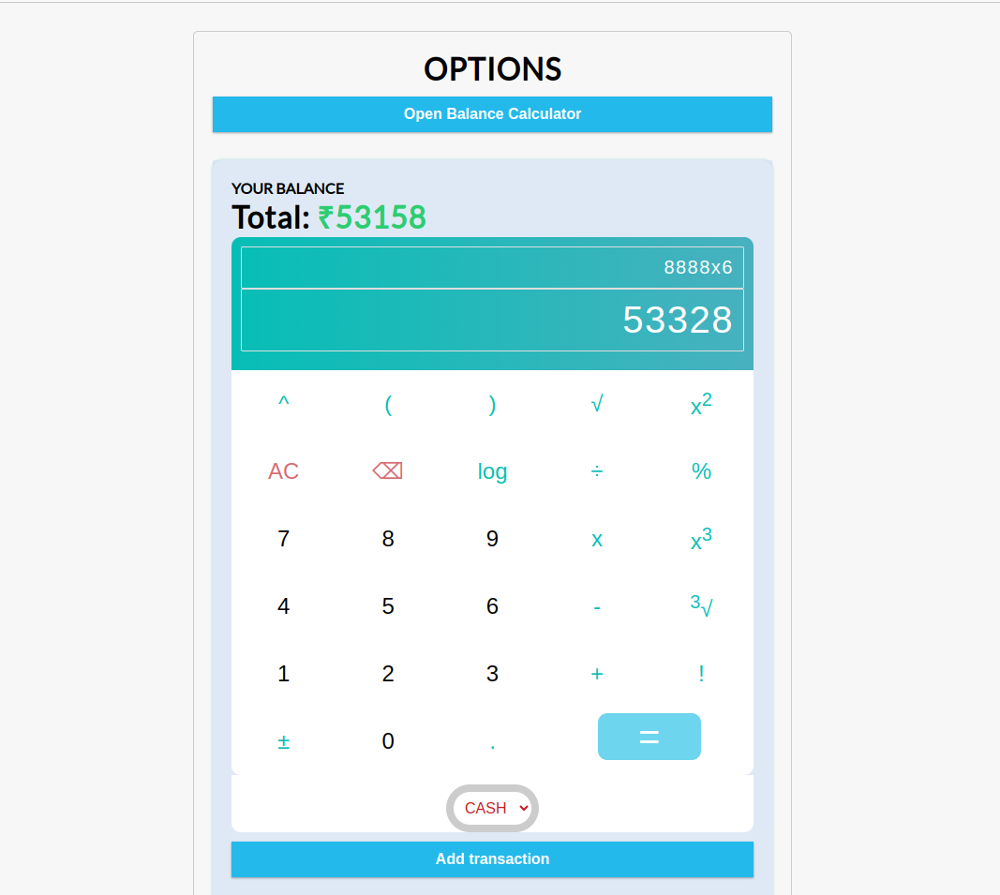
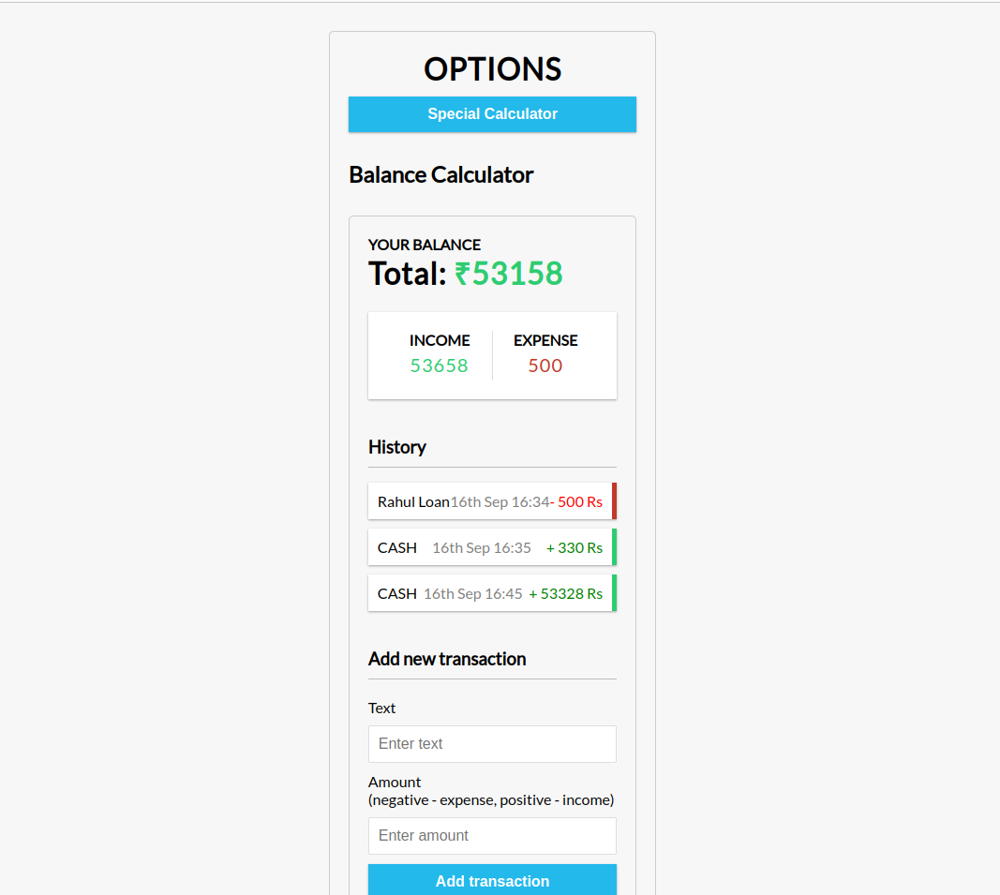

# SharkCalculator

## Overview

SharkCalculator is an innovative solution inspired by Shark Tank, designed specifically for shop owners who need a reliable and multifunctional tool for daily operations. It combines a basic calculator with an advanced ledger feature, all integrated into a single application. This tool also supports viewing UPI transactions, making it an invaluable asset for managing shop finances.

## Features

- **Basic Calculator:** Perform standard arithmetic operations.
- **Advanced Ledger:** Keep track of financial transactions and maintain detailed records.
- ~~**UPI Transaction Support:** View and manage UPI transactions seamlessly.~~

## Technologies Used

- **VITE v5.0.4:** Build tool and development server for modern web projects.
- **IndexedDB:** Client-side storage for managing and persisting ledger data.

## Installation

To set up SharkCalculator on your local machine, follow these steps:

1. **Clone the Repository:**
   ```bash
   git clone https://github.com/abhikdass/SharkCalculator.git
   ```

2. **Navigate to the Project Directory:**
   ```bash
   cd SharkCalculator
   ```

3. **Install Dependencies:**
   ```bash
   npm install
   ```

4. **Run the Development Server:**
   ```bash
   npm run dev
   ```

5. **Open the Application:**
   Visit `http://localhost:3000` in your web browser to start using SharkCalculator.

## Screenshots

Here are some screenshots showcasing the SharkCalculator application:

### Basic Calculator



### Advanced Ledger




## Contributing

Feel free to contribute to the development of SharkCalculator by submitting issues and pull requests on [GitHub](https://github.com/abhikdass/SharkCalculator).

For any questions or support, please open an issue on the GitHub repository or contact the project maintainer. feel free to contact me at dasabhik35@gmail.com

---

Thank you for using SharkCalculator!